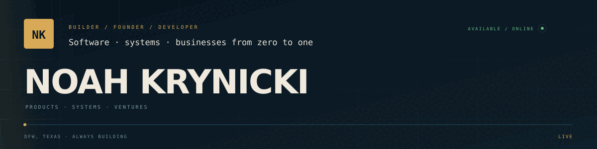

## Hey, I'm Noah.

I'm a software and product builder from the Dallas–Fort Worth area working across application development, technical operations, automation, and business systems.

Right now I'm building **FormForge** as founder/software developer with a private beta of **20+ testers**, developing **AeroOps** as a production-style aviation backend project, and building **Apex Aircraft Care**. I'm pursuing a **Bachelor of Business Administration at Western Governors University (WGU), expected May 2028**, and completing the requirements for **Texas Real Estate Sales Agent licensing**.

### Featured work

| Project | What it is | Focus |
| --- | --- | --- |
| [FormForge](https://github.com/thacanadian/Formforge) | Multi-user fitness platform with 20+ beta testers | Go, React Native/PWA, auth, security, AI/API integrations, testing, CI/CD |
| AeroOps | Production-style aviation operations backend — in development | backend architecture, authenticated services, reporting, testing, cloud deployment |
| [CinePulse](https://github.com/thacanadian/cinepulse) | Adaptive local-first movie recommendation system | JavaScript, recommendation algorithms, responsive UI |
| [LeadsAI](https://github.com/thacanadian/LeadsAI) | Cross-platform lead discovery and outreach tooling | TypeScript, APIs, automation, web scraping |
| Minecraft Systems | Java Edition mods/plugins with custom gameplay systems | Java, Fabric, Spigot/Paper, world-state and acoustic systems |
| [Apex Aircraft Care](https://github.com/thacanadian/Apex-Aircraft-Care) | Zero-to-one DFW aviation-service venture | operations, CRM, automation, sales systems |

### Technical stack

**Languages:** `Go` · `Java` · `JavaScript` · `TypeScript` · `Python` · `HTML/CSS` · `PowerShell`

**Frontend / Mobile:** `React` · `React Native` · `PWA`

**Cloud / Engineering:** `Azure` · `Cloudflare` · `Vercel` · `Netlify` · `Render` · `Git/GitHub` · `GitHub Actions` · `CI/CD` · `automated testing`

**APIs / Systems:** `OpenAI API` · `Gmail API` · `payment integrations` · `authentication` · `web scraping` · `workflow automation`

### Experience beyond personal projects

- Founder, Apex Aircraft Care
- Independent web-development support for 2–3 early-stage startup ventures: code, UI/design, analytics, SEO, APIs, deployment and maintenance
- Manager in high-volume service operations and informal technical escalation for POS, networking/connectivity, payment hardware and operational systems
- Volunteer technical production / IT support: AV routing, servers, presentation systems, troubleshooting and end-user support
- Former Trainer at Raising Cane's; onboarded 20+ teammates
- Java Edition Minecraft development using Fabric and Spigot/Paper

### Current focus

I'm open to internships and early-career opportunities across **software development, product engineering, technical operations, implementation, solutions engineering, and business systems**.

### Connect

[Portfolio source](https://github.com/thacanadian/portfolio) · [LinkedIn](https://www.linkedin.com/in/noah-krynicki-48513b312/) · [Email](mailto:noahwkry@gmail.com)

Public claims use real project status and verified metrics. Private customer data, credentials, internal pricing, and proprietary operating material stay private.
